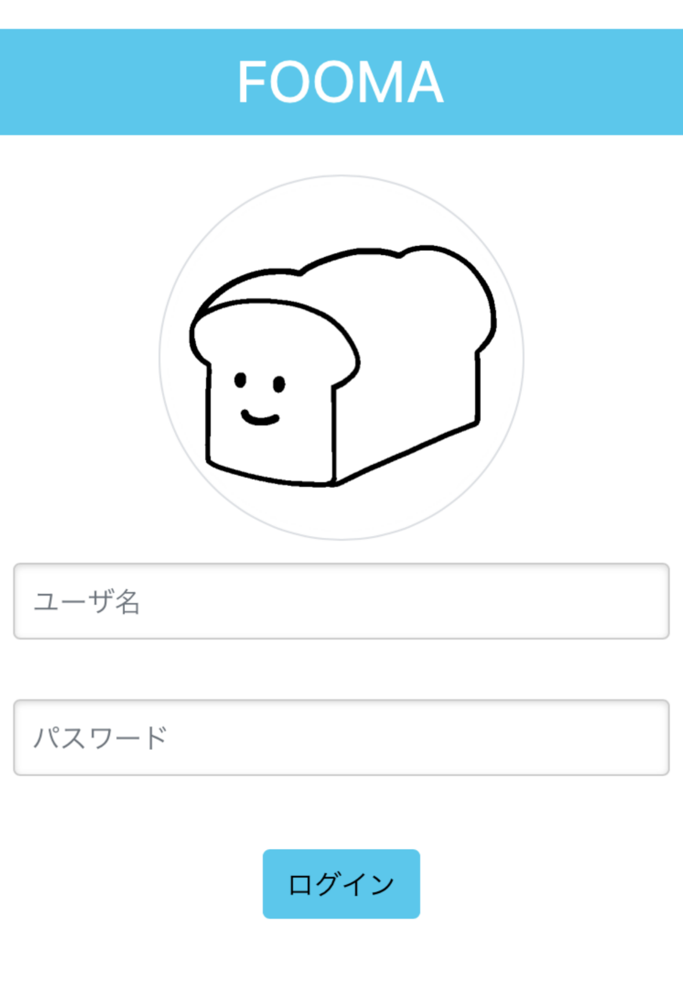

# FOOMA 簡易設計書

## 静岡大学院 室永将門


> ## アプリ名
>
> 
> ## アプリ名
>
> - FOOMA
>   - 食材管理アプリ:FOOd MAnager
>
>
>
> ## 対象OS
>
> - iOS,Android,Mac,Windows等ブラウザを使用できるOS
>
>
>
> ## 開発環境/言語
>
> - Python,Flask,HTML,CSS,Bootstrap,Pure-min
>
>
>
> ## 機能概要(機能一覧)
>
> - シェアハウス等で不足している食材をリスト化し，購入時にリストから削除することで同居人同士での食材の重複を防ぐ
>   - ログイン
>   - 不足食材名・個数追加
>   - 不足食材削除
>
>
>
> ## フレームワークのバージョン
>
> - Flask：v2.0.2
> - Bootstrap：v5.0.0
> - Pure-min：v1.0.1
>
>
>
> ## テーブル定義(ER図)など
>
> - データ総数が少ないためjsonにて管理
> - 管理データはログイン情報，不足食材データ
>   - ログイン情報（シェアハウスの同居人との使用を想定しているためソースコード内にて定義）
>     - user：ユーザ名
>     - pw：パスワード
>   - 不足食材データ（jsonファイルにて管理）
>     - food：不足している食材名
>     - num：不足している食材の個数
>     - user：不足食材リストに追加したユーザ名
>
>
>
> ## コンセプト
>
> - 私は現在シェアハウスをしており，買い出しの際に同居人と買ってくる食材が被るという問題があったので，Webアプリなどで解決できないかと思いこのアプリを作成しました．
> - 複数人で住んでいる人向けのサービスで，買い出ししたい食材をリスト化し，誰かがその食材を購入したらリストから削除します．
>
>
>
> ## こだわったポイント
>
> - 提出するコードということで様々な箇所を書き直し，コメントを多量に追加することで可読性の高いコードにしました．
> - 普段研究や競技プログラミングにてPythonを使っていたので，使い慣れているもので作成したいと思いPythonのフレームワークを調べ作成しました．
> - データベースを使うほどのデータ量でもないと思ったのでjsonファイルにて管理しました．
>
>
>
> ## アドバイスして欲しいポイント
>
> - jsonファイルよりもデータベース等を使った方が良いのか
> - どんな機能を追加したらより使いやすくなるのか
> - Webアプリとして足りない機能や機構はあるのか
>
>
>
> ## デザイン面に関して見て欲しいポイント
>
> - 食材管理アプリだが配色は何色が良いのか
> - 各オブジェクトのレイアウト等は大丈夫なのか
> - イラストは無料の商用利用可能のものを使用しているが，加工や編集して見た目をよく出来ないか
>
>
>
> ## 自己評価
>
> - 機能面は最低限しか実装していないと思うので，これからさらに機能を追加しブラッシュアップしたいです．具体的には以下のような機能を追加したいと思っています．
>   - 通知
>     - スマホアプリの場合LINE等と連携しLINEに通知を送る
>   - 使用金額管理
>   - ログの表示
>     - 過去，削除済みのデータを復元，閲覧できるように
>   - 同一食材の統合
>     - 同じ食材名があったとき個数をまとめる
>   - アカウント作成
>     - リリースを考えた場合，他人も使用できるようにする必要がある
> - デザイン面において，CSSの基本的な使用方法や「デザインを見て実装する方法」は分かるのですが，見た目の良いデザインの作成方法，デザインについての知識等，「デザインの見た目を作る方法」をほぼ勉強したことがありません．なので，今後はデザインについての勉強もしたいと考えています．
>
>
>
> ## プロジェクト構築法
>
> - データベースを構築する
>
>   - 以下コマンドでデータベースのテーブルを作成する
>
>     ```
>     $ python3 database.py
>     ```
>
>
>
>   - 以下コマンドでbcrypt（パスワードの暗号化に使用）をインストールする
>
>     ```
>     $ pip3 install flask-bcrypt
>     ```
>
>
>
>   - 新規ユーザ登録機能が完成していない場合ユーザ登録を行う
>
>     - 現時点で未完成
>
>       ```
>       $ sqlite3 fooma.db
>       sqlite> insert into users (name, pass) values(ユーザ名, パスワード)
>
>       ex)
>       sqlite> insert into users (name, pass) values('muro', 'aaa')
>
>
>
> - 実行方法
>
>   - 以下のコマンド実行後，http://0.0.0.0:5000/にアクセス
>
>   	```
>   	$ python3 app.py
>   	>    * Serving Flask app "app" (lazy loading)
>   	>    * Environment: production
>   	>      WARNING: This is a development server. Do not use it in a production deployment.
>   	>      Use a production WSGI server instead.
>   	>    * Debug mode: off
>   	>    * Running on http://0.0.0.0:5000/ (Press CTRL+C to quit)
>   	```
>
>
>
>
> ## 動作画面
>
> 
>
>
>
> 

